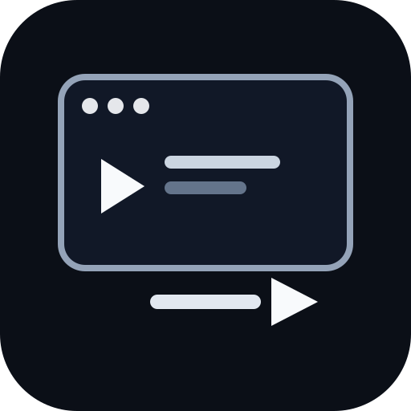

<p align="center"></p>

# Richlesson

[](https://github.com/iamrichmack111/richlesson-remotion-v3/actions/workflows/ci.yml)
[](https://github.com/iamrichmack111/richlesson-remotion-v3/actions/workflows/security.yml)
[](https://github.com/iamrichmack111/richlesson-remotion-v3/actions/workflows/docker-publish.yml)
[](https://github.com/PyCQA/bandit)


**Terminal-first AI-assisted lesson-to-video generation from Markdown or plain text.**

Richlesson separates content interpretation from deterministic video rendering. Structured lessons work without AI. Ordinary prose can be reorganized with a local Ollama model, normalized into a lesson JSON contract, narrated with neural TTS, rendered with Remotion, and optionally published to YouTube.

## Architecture

```text
Markdown / TXT
      |
      +---- structured ----> deterministic parser
      |
      +---- --ai ----------> local Ollama
                               |
                               v
                         lesson planning
                               |
                               v
                         scene compiler
                               |
                               v
                        source grounding
                               |
                               v
                          quality gate
                               |
                    +----------+----------+
                    |                     |
                    v                     v
              neural narration       Remotion scenes
                    |                     |
                    +----------+----------+
                               |
                               v
                              MP4
                               |
                               v
                     optional YouTube upload
```

## Features
- Markdown and TXT inputs.
- Deterministic non-AI mode.
- Local Ollama-assisted lesson planning.
- JSON rendering contract.
- Many semantic scene types, layouts, and themes.
- Neural narration and captions.
- 720p, 1080p, 1440p, 4K, Shorts, square presets.
- Optional private/unlisted/public YouTube delivery.
- Markdown/text description files.
- Source-grounding/quality architecture.
- Docker + Compose.
- CI, Bandit, audits, Dependabot.
- Multi-arch GHCR CD on tags.
- D2 diagrams, SVG icon, man page, detailed wiki source.

## Setup
```bash
python3 -m venv .venv
source .venv/bin/activate
python -m pip install --upgrade pip
python -m pip install -r requirements-runtime.txt
npm ci
```

macOS:
```bash
brew install ffmpeg jq
```

## Usage
Structured:
```bash
./richlesson.sh lessons/improvement.md
```
AI:
```bash
./richlesson.sh article.txt --ai --model gemma3:4b
```
1080p:
```bash
./richlesson.sh article.md --ai --resolution 1080p
```
Shorts:
```bash
./richlesson.sh article.md --ai --resolution shorts
```
Private YouTube:
```bash
./richlesson.sh article.md --ai --youtube --privacy private --description description.md
```

## Themes
Examples: cinematic-glass, blueprint, terminal-noir, neon-grid, editorial, paper-ink, retro-future, classroom, data-lab, minimal-luxury, space-console, industrial, midnight-academy, signal, monochrome.

## Security
Do not commit OAuth clients, YouTube refresh tokens, private source books, environment secrets, private keys, or generated credentials. AI-generated factual content must be reviewed before public release.

## Docker
```bash
docker build -t richlesson:local .
docker compose build
```

## CI/CD
CI checks TypeScript, Python, Ruff, ShellCheck, JSON, and Docker. Security checks Bandit plus Python/npm dependency audits. Full video rendering is intentionally excluded from routine CI.

Release:
```bash
git tag v0.3.0
git push origin v0.3.0
```
This publishes a multi-architecture GHCR image and creates a GitHub Release.

## Documentation
- [Docker](docs/DOCKER.md)
- [D2 diagrams](docs/DIAGRAMS.md)
- [Man page](docs/MANPAGE.md)
- [Wiki source](docs/wiki/Home.md)

Man page:
```bash
man ./man/richlesson.1
```

D2:
```bash
d2 docs/diagrams/architecture.d2 docs/architecture.svg
```

## Wiki
Initialize the GitHub Wiki once in the web UI, then:
```bash
./scripts/sync-wiki.sh
```
The wiki clone/push uses SSH: `git@github.com:iamrichmack111/richlesson-remotion-v3.wiki.git`.

## Development principles
1. human-readable source is canonical,
2. AI is optional,
3. AI plans/structures rather than silently becoming factual authority,
4. JSON is the rendering boundary,
5. publishing is separate and optional,
6. secrets never enter Git/Docker layers,
7. architecture documentation changes with architecture.
